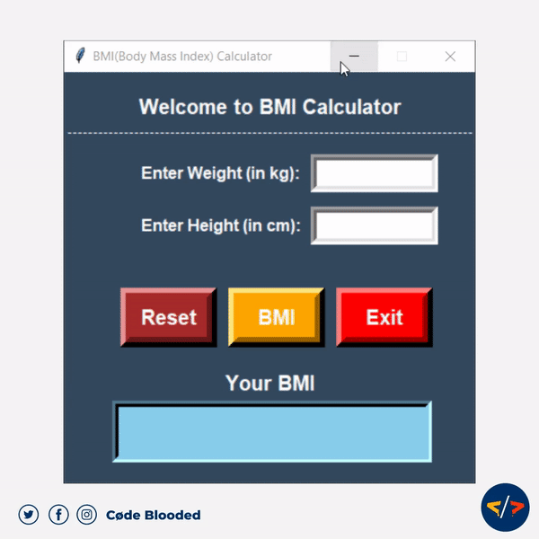

# BMI-Calculater

# Project Description

- **BMI stands for `body mass index.`**
- **It helps you understand how much body mass an individual has with regard to his weight and height.**
- **BMI calculator is widely used as a reliable indicator of one’s healthy body weight for their height.**
- **A BMI calculator lets you determine how healthy you are and whether you are within the normal weight range if you are underweight or overweight as per your height.**

